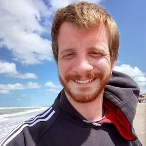

Hola!
Mi nombre es Juan Pablo Bianchi. 
Actualmente estoy trabajando como electricista e instalador de aires acondicionanos.

Elegí estudiar la tecnicatura en programación en un principio para tener una mayor seguridad laboral. Por suerte descubrí que es algo que me apasiona, tanto que en paralelo estoy haciendo cursos complementarios. Entre ellos, un curso de programación orientada a objetos con C#.

Para esta materia espero poder afianzar algunos conocimientos que tengo y sobre todo poder aprender con mayor rigor académico sobre el tema.
Me entusiasmó mucho la primera clase en la que dijeron que ibamos a tener como trabajo final el desarrollo de un videojuego.

Exitos a todos!!!